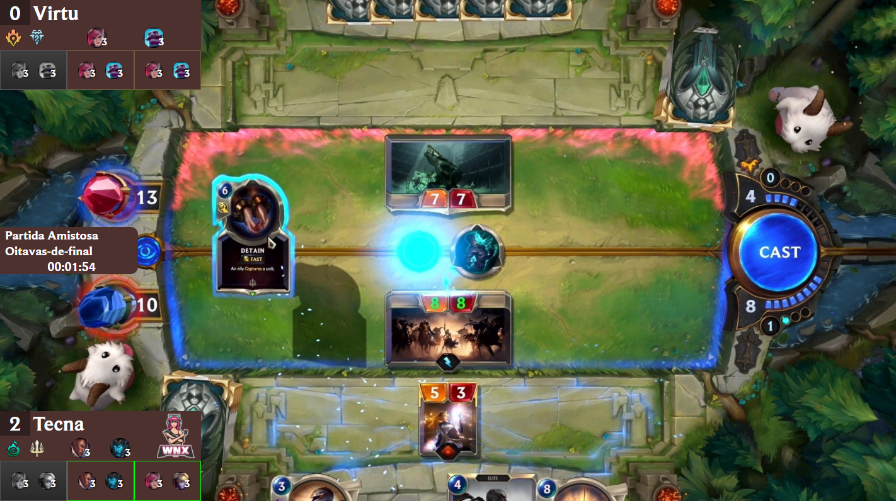

<h1 align="center">Overlay Legends of Runeterra</h1>

<h2 align="center">Agora on-line em: <a href="https://lor-torneio-overlay.xtecna.vercel.app/">https://lor-torneio-overlay.xtecna.vercel.app/</a></h2>

  Esse projeto consiste em um overlay para torneios de LoR, desenvolvido ao vivo no canal <a href="https://www.twitch.tv/xtecna">https://www.twitch.tv/xTecna</a>. Acesse e deixe seu follow para acompanhar o projeto.

  Para mais informações você pode acessar esse vídeo que explica o projeto <a href="https://clips.twitch.tv/SpikyPeppyVelociraptorHumbleLife">https://clips.twitch.tv/SpikyPeppyVelociraptorHumbleLife</a>.

Funcionalidades atuais suportadas pelo overlay:

<ul>
  <li>Link único de visualização remota para colocar no OBS. (basta copiar o ID do sessão e criar um novo Browser que redireciona para <code>https://[link do overlay]/[ID]</code>)</li>
  <li>Visualização das webcams dos jogadores, fácil de encaixar a webcam pelo OBS.</li>
  <li>Cronômetro com tempo limite.</li>
  <li>Suporte a três das regras mais populares em campeonatos: regionlock, cardlock e riotlock.</li>
  <li>Gerenciamento da partida atual com escolha de ban e atualização de score.</li>
  <li>Gerenciamento das partidas, participantes e times do campeonato.</li>
</ul>

Funcionalidade futuras:

<ul>
  <li>Exportação das partidas, participantes e times para arquivo CSV.</li>
  <li>Customização da aparência do overlay.</li>
  <li>Interface responsiva para dispositivos móveis.</li>
  <li>Generalização para campeonatos com número variado de decks (não apenas 3).</li>
</ul>

<h3>Agradecimentos:</h3>

<ul>
  <li>lipeavelar</li>
  <li>alki_1</li>
  <li><a href="https://www.twitch.tv/davibusanello">DaviBusanello</a></li>
  <li><a href="https://www.twitch.tv/edersondeveloper">edersondeveloper</a></li>
  <li><a href="https://www.twitch.tv/tonyalkm">tonyalkm</a></li>
  <li>zVirtu</li>
  <li><a href="https://www.twitch.tv/alorenato">AloRenato</a></li>
  <li><a href="https://www.twitch.tv/lapingvino">LaPingvino</a></li>
  <li><a href="https://www.twitch.tv/jpbrab0">jpbrab0</a></li>
  <li><a href="https://www.twitch.tv/morgiovanelli">morgiovanelli</a></li>
  <li>JJohnatan</li>
  <li>ZairaGoncalves</li>
  <li><a href="https://www.twitch.tv/mahsgarbi">MahSgarbi</a></li>
  <li><a href="https://www.twitch.tv/pokemaobr">pokemaobr</a></li>
  <li><a href="https://www.twitch.tv/viktorkav">ViktorKav</a></li>
  <li>ChicoCodes</li>
  <li>MarieEmAlgumLugarDoMundo</li>
  <li><a href="https://www.twitch.tv/pachicodes">PACHIcodes</li>
  <li>MaterazziStark</li>
  <li>seja_um_pouco_mais_feliz</li>
</ul>

Obrigada pelo apoio de cada um de vocês a esse projeto e ao canal!

