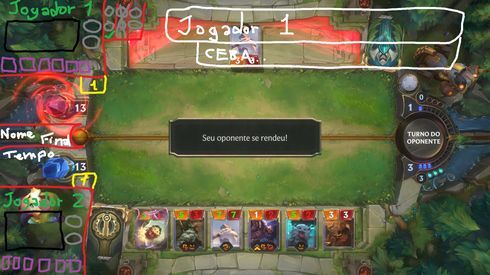

<h1 align="center"></h1>

<h1 align="center">Overlay Legends of Runeterra</h1>

<!-- 

  

 -->

  Esse projeto consiste em fazer um overlay para torneios de LOR, ele esta sendo desenvolvido ao vivo no canal <a href="https://www.twitch.tv/xtecna">https://www.twitch.tv/xtecna</a> acesse e deixe seu follow para acompanhar o projeto.

  Para mais informações você pode acessar esse vídeo que explica o projeto <a href="https://clips.twitch.tv/SpikyPeppyVelociraptorHumbleLife">https://clips.twitch.tv/SpikyPeppyVelociraptorHumbleLife</a>.

  Logo abaixo você pode ver um exemplo de tela do overlay.

